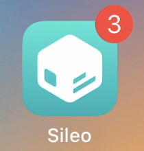
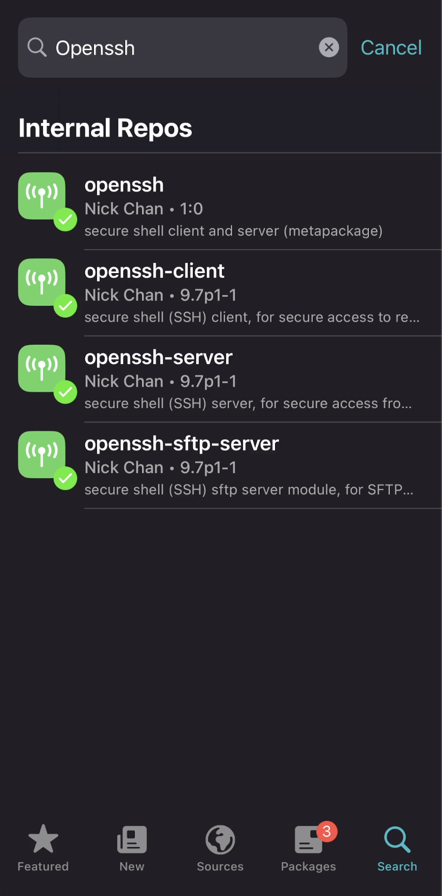
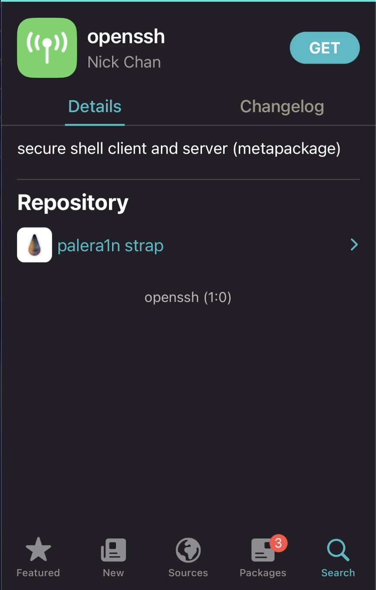

## 🚀 Prerequisites

- Jailbroken iOS device (проверено на MacBook Pro M1, на Linux общий флоу такой же, но есть нюансы)
- [Sileo](https://getsileo.app/) или [Zebra](https://getzebra.app/) — менеджер пакетов
- [usbmuxd](https://github.com/libimobiledevice/usbmuxd) (`iproxy`)
- [Frida](https://github.com/frida/frida/releases)
- [Burp Suite](https://portswigger.net/burp)
- [frida-ios-dump-ng](https://github.com/incogbyte/frida-ios-dump-ng)
- [Ghidra](https://github.com/nationalsecurityagency/ghidra)

## 🚀 iOS Workflow

### 1. Jailbreak

Сначала нужно получить jailbreak на нашем устройстве. Задача не всегда тривиальная, но у нас он уже есть. Осталось только активировать его:

<video>
  <source src="imgs/1.mp4" type="video/mp4">
</video>

Нажимаем Enter, когда сами готовы выполнить следующий пункт.

Когда появятся соответствующие надписи «Hold volume down + side button» и «Hold volume down button», нужно нажать соответствующие кнопки на устройстве.

Теперь у нас есть возможность устанавливать твики, подключаться по SSH, устанавливать софт и т.д.

Твики для джейлбрейка — это программные дополнения, устанавливаемые через менеджер пакетов, такой как Sileo или Zebra, для изменения или добавления функций в iOS.

### 2. Установка пакетов

Открываем предустановленный менеджер пакетов, в нашем случае это Sileo.



Устанавливаем OpenSSH для более комфортной работы в терминале.

В поиске пишем `openssh`.



Нажимаем Get, подтверждаем в очереди.



### 3. SSH

Чтобы подключиться по SSH, нужно найти IP вашего устройства, который находится в той же сети, что и ваш ПК. А ещё можно прокинуть трафик с 22 порта устройства на 2222 порт ПК через USB, к которому подключён iPhone, и делать SSH локально.

Нужно установить и запустить `iproxy`:

```bash
brew install usbmuxd
iproxy 2222 22
```

Пробуем подключиться к порту 2222:

```bash
ssh root@localhost -p 2222
```

Если не подключается, то:

```bash
ssh mobile@localhost -p 2222
```

Вводим пароль — по умолчанию `alpine`. Если забыли пароль, можно изменить hash пароля для пользователя root через Filza, более подробно можно нагуглить :)

### 4. Frida

Можно установить через Sileo, добавив новый источник пакетов, но я предпочитаю установку определённой версии, поэтому проще сделать через `dpkg` в терминале.

Идём на https://github.com/frida/frida/releases, находим интересующую версию (16.5.9).

В терминале смотрим версию процессора:

```bash
uname -m
```

Скачиваем соответствующий пакет, у меня `frida_16.5.9_iphoneos-arm.deb`:

```bash
wget https://github.com/frida/frida/releases/download/16.5.9/frida_16.5.9_iphoneos-arm.deb
dpkg -i frida_16.5.9_iphoneos-arm.deb
frida-server --version
```

Если отсутствует wget просто скачайте в Sileo/Cydia или в терминале:
```bash
sudo su
apt-get update && apt-get install wget
```

### 5. Burp

Есть прекрасная подробная статья у PortSwigger, в которой расписаны все шаги:
https://portswigger.net/burp/documentation/desktop/mobile/config-ios-device

### 6. IPA с устройства

Чтобы получить `.ipa` файл, который будем в дальнейшем исследовать, можно использовать iDump или fridump.

Я использую `frida-ios-dump-ng`, можно найти здесь: https://github.com/incogbyte/frida-ios-dump-ng

Просто запускаем скрипт, выбираем интересующее приложение и получаем `.ipa` файл.

### 7. Reverse Engineering the app

`.ipa`, так же как и `.apk`, — это просто архив, поэтому мы можем сделать:

```bash
unzip App.ipa
```

Сначала можно посмотреть на файл `Info.plist`, который содержит основные метаданные об iOS-приложении, включая идентификатор пакета, отображаемое имя, номер версии и номер сборки. Он также определяет технические требования, такие как минимальная поддерживаемая версия iOS, поддерживаемые типы устройств (iPhone/iPad) и имя исполняемого файла приложения. Кроме того, в нём перечислены описания использования разрешений (например, для камеры, местоположения или контактов) и другие параметры конфигурации, такие как поддерживаемые ориентации и правила сетевой безопасности. Он лежит в корневой директории разархивированного приложения.

Переводим в читаемый вид:

```bash
plutil -convert xml1 Info.plist -o Info_readable.plist
```

Основная логика, конечно, лежит в исполняемом бинарном файле, который также находится в корневой директории разархивированного приложения. В этом можно убедиться, найдя значение ключа `CFBundleExecutable` в файле `Info.plist`.

Скачиваем и устанавливаем Ghidra — на мой взгляд, это наиболее сбалансированный по возможностям и удобству инструмент для реверс-инжиниринга:
https://github.com/nationalsecurityagency/ghidra

В меню находим `File → New Project`, создаём проект, выбираем, где он будет храниться.

`File → Import File` — загружаем наш бинарный файл.

Дважды кликаем на файл в проекте, нажимаем Analyze. Возможно, потребуется разрешить работу деманглера в настройках безопасности macOS.

Здесь уже можно искать интересующие строки и классы. Стоит поискать `application:didFinishLaunchingWithOptions:` — метод, отвечающий за код, который выполнится после загрузки экрана.

### 8. Когда заболят глаза реверсить

Если вы сделали шаг 4, то у вас должна заработать динамическая отладка:

```bash
frida-ps -Ua
objection -n <identifier из 3 колонки> start
```

Здесь внутри objection вы можете написать любую команду, например чтобы найти UUID директории вашего приложения:

```bash
env
```

Подробнее о возможных командах см. [тут](https://github.com/sensepost/objection/wiki)
