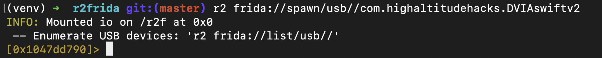
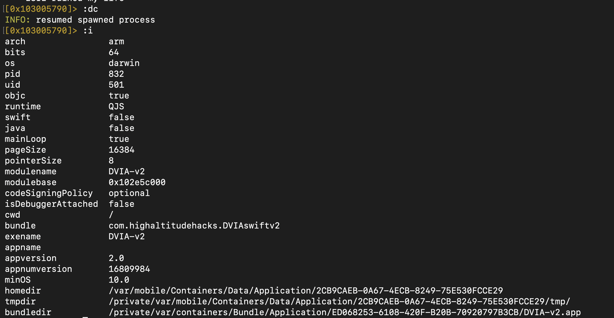
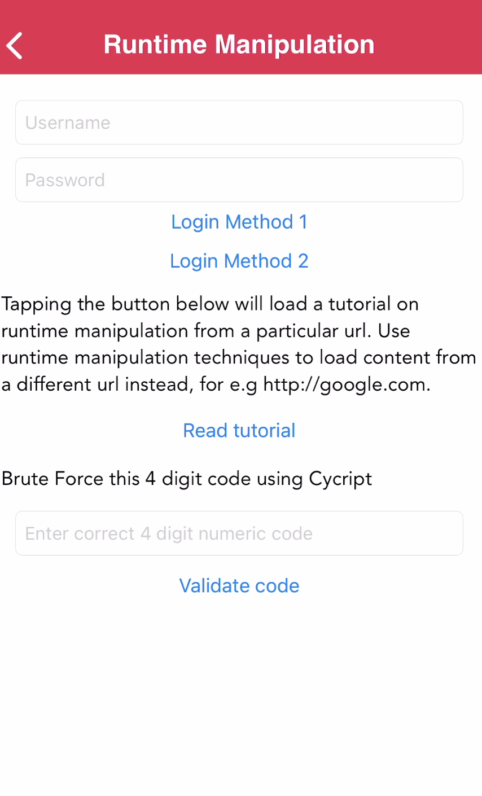
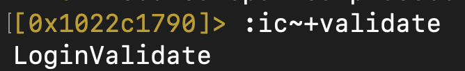
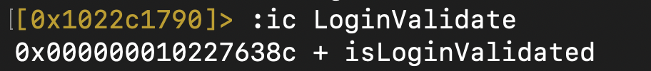
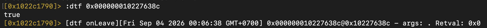
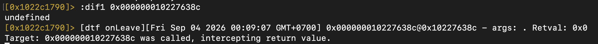
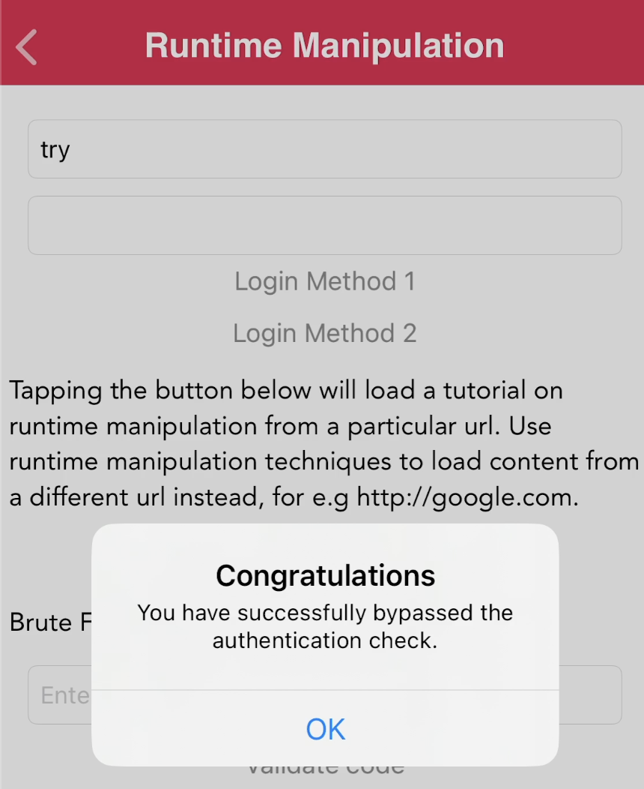
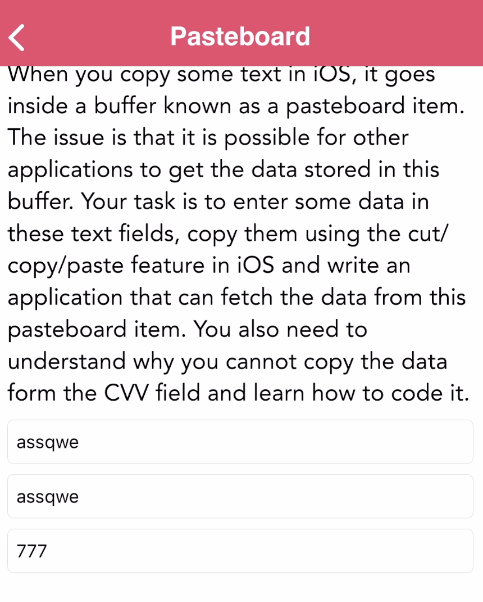
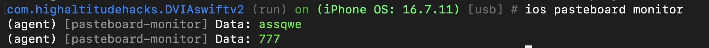

## 🚀 Prerequisites

- Jailbroken iOS device с установленным [DVIA-v2](https://github.com/prateek147/DVIA-v2) (Damn Vulnerable iOS App v2)
- [radare2](https://github.com/radareorg/radare2) (`r2`)
- [r2frida](https://github.com/nowsecure/r2frida) — интеграция radare2 с функционалом перехвата от Frida
- Запущенный `frida-server` на устройстве
- [objection](https://github.com/sensepost/objection)

## 🚀 Runtime Manipulation в DVIA-v2 (r2frida)

### 1. Установка r2frida

Решаем runtime manipulation в DVIA-v2 с помощью r2frida — это интеграция крутой тулзы по реверсу (radare2) и функционала перехвата от Frida.

Установить можно через менеджер пакетов внутри r2:

```bash
r2pm -ci r2frida
```

На момент написания методички r2frida скомпилирована под `frida-server` версии 17.15.1, на телефоне у меня стоит версия 17.17.0 — совместимость хромает, но тоже норм.

### 2. Запуск отладки приложения

Запускаем приложение для отладки:

```bash
r2 frida://spawn/usb//com.highaltitudehacks.DVIAswiftv2
```



Отладка уже по сути работает, поэтому для дальнейшего запуска приложения пропишем:

```
:dc
```

### 3. Информация о приложении

Посмотрим информацию о приложении:

```
:i
```



### 4. Поиск метода валидации логина

Перейдём теперь в сам экран задания и нажмём Start Challenge.



Здесь мы видим метод валидации логина, попробуем его поискать в классах приложения:

```
:ic~+validate
```



Первым видим класс `LoginValidate`.

### 5. Поиск методов класса

Посмотрим, какие методы в нём есть.



### 6. Хук метода и подмена возвращаемого значения

Теперь попробуем посмотреть, что он возвращает — хукнем с помощью:

```
:dtf <address>
```

Далее нажмём Login method 1 на экране.



Видим, что есть `retval`, значит можем подменить его через команду:

```
:dif1
```

Она вернёт возвращаемое значение, подменённое на 1.




Видим заветное Congratulations.

## Легкий Objection: Pasteboard monitor

Следующая проблема решается в один шаг — просто запускаем objection и в нём же выполняем команду:

```
ios pasteboard monitor
```



